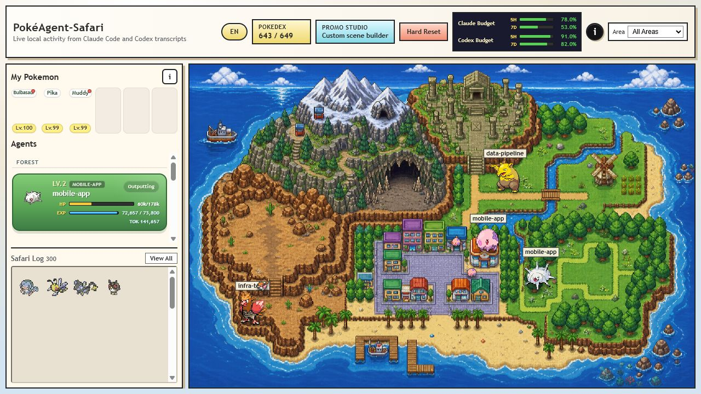
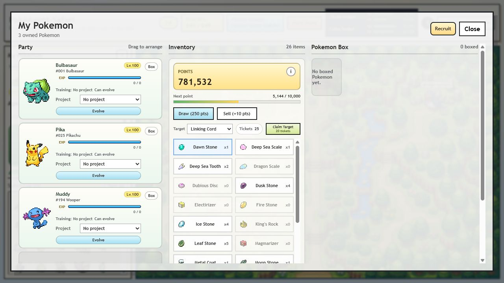
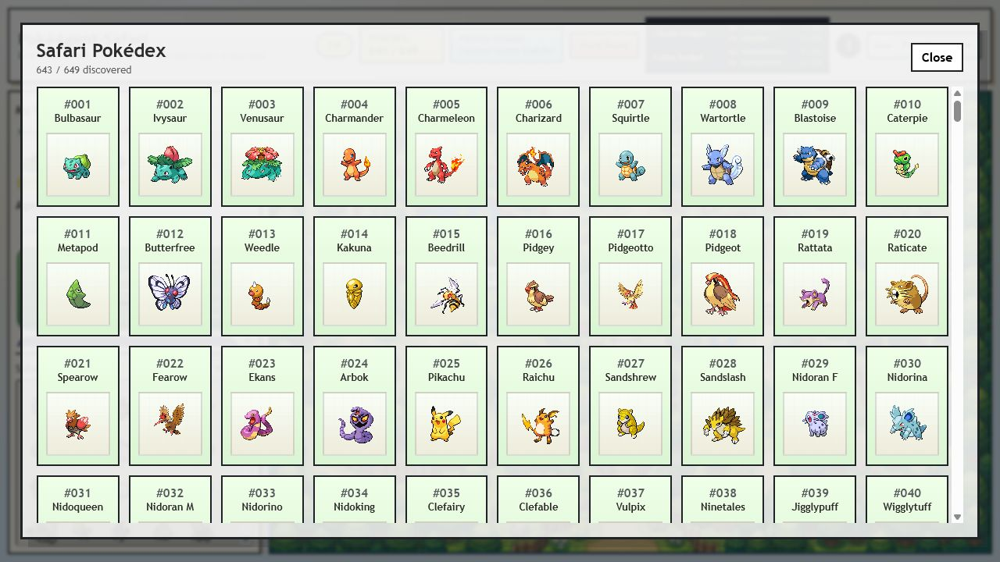
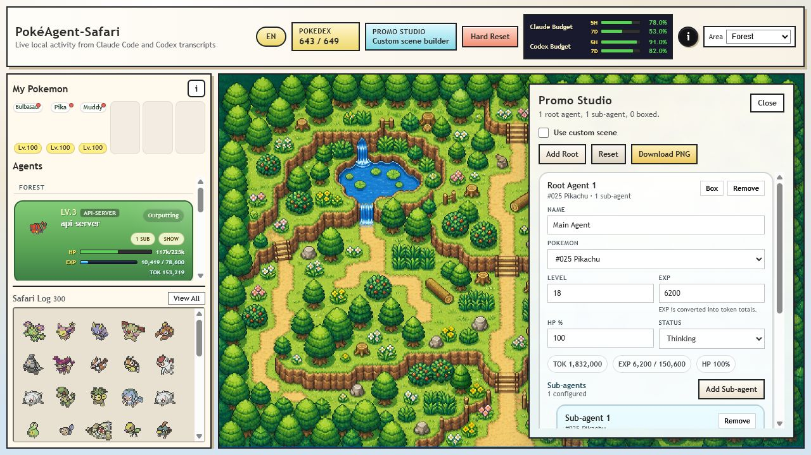
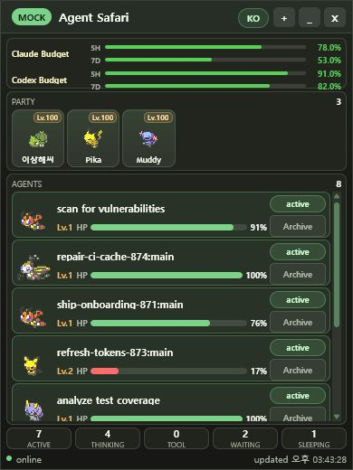

<p align="left"><a href="./README.md">English</a> | <strong>한국어</strong></p>

# PokéAgent-Safari

## v0.2.0 - Collection & Sticker Release



`poke-agent-safari`는 Claude Code와 Codex를 위한 로컬 활동 대시보드입니다. transcript 활동을 감시해 살아 있는 agent를 포켓몬으로 표시하고, context, 토큰 사용량, 상태, 프로젝트, 세션 기록을 작은 RPG 사파리처럼 보여줍니다.

v0.2.0에서는 대시보드가 수집/육성 루프로 확장되었습니다. 포켓몬을 `My Pokemon`에 영입하고, 실제 프로젝트 토큰 사용량으로 훈련시키고, 진화 아이템을 모으고, Gen 1-5 기준 생성 규칙으로 진화시키며, 작업 중에는 항상 위에 뜨는 Electron sticker를 켜둘 수 있습니다.

## 릴리스 하이라이트

- **Claude + Codex 통합:** `--source all`이 기본값입니다. `--source claude`, `--source codex`도 계속 사용할 수 있습니다.
- **설치형 CLI:** `npm install`로 사용자 계정에 `poke-as` 명령을 등록합니다. 기본 실행은 Electron sticker입니다.
- **My Pokemon:** encounter 또는 Pokedex에서 포켓몬을 영입하고, 6칸 party, Pokemon Box, 닉네임, release, 프로젝트 배정을 관리합니다.
- **Training:** owned Pokemon은 실제 토큰 사용량으로 EXP를 얻습니다. 프로젝트가 일치하는 포켓몬은 더 높은 training weight를 받습니다.
- **Evolution items:** 토큰 사용량으로 item point를 얻고, random draw로 진화 아이템을 얻고, target ticket으로 원하는 아이템을 확정 획득할 수 있습니다.
- **Gen 1-5 Pokedex:** `#1-#649` 범위를 지원하며 habitat, rarity, evolution path, 한국어 이름, 진화 규칙 데이터가 포함됩니다.
- **Area-aware island:** habitat 기반 spawn, area filter, detail map asset, outside-area rail이 추가되었습니다.
- **Electron sticker:** 예산, party Pokemon, 활성 agent, 상태 카운트를 보여주는 컴팩트 데스크톱 모니터입니다.
- **Promo Studio:** mock mode에서 custom scene을 만들고 PNG로 내보낼 수 있습니다.
- **VS Code extension refresh:** 같은 UI에서 Claude, Codex, all providers, mock mode를 열 수 있습니다.
- **Unified persistence:** live state는 `data/runtime/all`에 저장되고, Claude/Codex 호환 mirror도 함께 유지됩니다.

## 둘러보기

### Live Dashboard

메인 대시보드는 habitat-aware island, live provider budget, Pokedex progress, My Pokemon, Safari Log를 한 화면에 보여줍니다.


### My Pokemon And Evolution Items

owned Pokemon은 party slot, level, EXP bar, project assignment, evolution state, box control을 가집니다. Inventory panel은 item point, random draw, target ticket, item sprite, sell, target claim을 보여줍니다.



### Pokedex

발견한 포켓몬은 first-discovery metadata와 함께 등록됩니다. 현재 Pokedex 범위는 `#1-#649`입니다.



### Promo Studio

Mock mode에서는 Promo Studio를 사용할 수 있습니다. custom scene을 만들고, 포켓몬을 고르고, level/EXP/HP/status를 조정하고, subagent를 추가하고, scene을 PNG로 다운로드합니다.



### Electron Sticker

sticker는 매일 켜두기 좋은 always-on-top compact view입니다. 전체 대시보드와 같은 runtime과 snapshot payload를 사용합니다.



## 설치

필수 조건:

- Node.js `>=18`
- npm
- git

clone 후 설치합니다.

```bash
git clone git@github.com:Hwiyeon/poke-agent-safari.git
cd poke-agent-safari
npm install
npm run setup
```

선택 사항: CLI shim만 다시 등록

```bash
npm run setup:cli
```

선택 사항: Claude/Codex runtime permission 정리만 다시 실행

```bash
npm run setup:permissions
```

`npm install`은 `poke-as` 명령 등록을 best-effort로 자동 실행합니다. `npm run setup`은 로컬 Claude/Codex runtime 경로 권한을 정리하고, CLI shim을 다시 등록하고, `public/vendor/pokeapi-sprites` 아래에 sparse PokeAPI sprite checkout을 만들거나 갱신하고, 필요한 item sprite를 `public/item-sprites`로 복사하며, `data/map_assets`의 필수 지도 asset을 검증합니다.

Ubuntu 22.04에서는 Electron 실행을 위해 표준 데스크톱 runtime library가 필요할 수 있습니다.

```bash
sudo apt update
sudo apt install -y libnss3 libatk-bridge2.0-0 libgtk-3-0 libxss1 libasound2 libgbm1
```

## 빠른 시작

Electron sticker 열기:

```bash
poke-as
```

sticker의 `+` 버튼을 누르면 전체 대시보드로 확장됩니다.

provider별 sticker 실행:

```bash
poke-as --source all
poke-as --source claude
poke-as --source codex
```

Mock sticker:

```bash
poke-as --mock
```

Web dashboard:

```bash
poke-as web
```

그 다음 브라우저에서 엽니다.

```text
http://127.0.0.1:8123
```

Web mock mode:

```bash
poke-as web --mock
```

SSH 원격 Electron viewer:

```bash
# 원격 서버. headless Linux에서는 그냥 `poke-as`가 이 web mode로 fallback합니다.
poke-as --host 127.0.0.1 --port 8123 --source all
```

```bash
# 로컬 머신
ssh -N -L 8123:127.0.0.1:8123 user@server
poke-as viewer
```

`viewer`는 로컬 transcript를 감시하거나 로컬 dashboard server를 띄우지 않습니다. 원격 dashboard를 always-on-top Electron sticker로 보여주기만 합니다. 위 터널 방식에서는 `poke-as viewer`가 기본값으로 `http://127.0.0.1:8123`을 사용하므로 `--url`을 생략할 수 있습니다. 원격 서버에 GUI가 있고 web-only mode를 강제하고 싶다면 `poke-as web --host 127.0.0.1 --port 8123 --source all`을 쓰면 됩니다.

기존 web alias도 계속 동작합니다.

```bash
poke-as watch
npm run watch
npm run mock
```

## CLI Reference

```bash
poke-as [--source claude|codex|all] [--port 8123] [--path ~/.claude/projects] [--codex-path ~/.codex/sessions] [--no-pokeapi]
poke-as --mock [--port 8123] [--no-pokeapi]
poke-as sticker [--source claude|codex|all] [--port 8123]
poke-as viewer [--url http://127.0.0.1:8123] [--host 127.0.0.1 --port 8123]
poke-as web [watch|mock] [--source claude|codex|all] [--port 8123]
poke-as watch [--source claude|codex|all] [--port 8123]
poke-as hard-reset [watch|mock] [--source claude|codex|all]
poke-as help
```

Config 우선순위:

```text
defaults < config.json < environment variables < CLI flags
```

환경 변수:

```text
PORT
HOST
AGENT_SAFARI_SOURCE
CLAUDE_PROJECTS_PATH
CODEX_SESSIONS_PATH
ACTIVE_TIMEOUT_SEC
STALE_TIMEOUT_SEC
ENABLE_POKEAPI_SPRITES
```

## 작동 방식

### Agents

- `HP`는 남은 context window입니다.
- `EXP`와 `LV`는 토큰 사용량입니다.
- `Status`는 thinking, tool-running, outputting, waiting, sleeping 상태를 보여줍니다.
- root agent는 큰 포켓몬으로 표시됩니다.
- subagent는 가능한 경우 같은 진화 라인의 작은 포켓몬으로 근처에 표시됩니다.
- watch mode에서 조용한 root agent는 `10분` 후 `Sleeping`이 됩니다.
- stale root agent는 `8시간` 후 Safari Log로 이동합니다.

### My Pokemon

- 활성 encounter 또는 발견한 Pokedex entry에서 포켓몬을 영입합니다.
- 6칸 party와 Pokemon Box를 관리합니다.
- 닉네임 변경, release, box/unbox, party 재정렬을 지원합니다.
- 포켓몬을 프로젝트에 배정하면 해당 프로젝트 활동으로 더 빠르게 훈련됩니다.
- 원하면 진화를 보류할 수 있습니다.

Training rules:

- agent 토큰 `20`개가 배분 전 owned Pokemon EXP `1`이 됩니다.
- 프로젝트가 일치하는 배정 포켓몬은 allocation weight `5`를 받습니다.
- 프로젝트가 없는 포켓몬은 일반 training share를 받을 수 있습니다.
- training event는 저장되고 dashboard snapshot에 포함됩니다.

### Evolution Items

- total token `10,000`개마다 item point `1`을 얻습니다.
- random draw는 item point `250`을 사용합니다.
- draw 성공률은 `30%`입니다.
- target item은 draw weight `2.5x`를 받습니다.
- target이 설정된 상태에서 성공했지만 target item이 나오지 않으면 target ticket `1`을 얻습니다.
- target ticket `20`개로 선택한 target item을 확정 획득할 수 있습니다.
- 아이템 판매는 item point `10`을 돌려줍니다.
- point 직접 구매는 비활성화되어 있습니다.

아이템 pool은 Gen 1-5 진화 아이템과 trade-style 진화를 위한 `linking-cord`를 포함합니다. 진화 규칙은 `data/evolution_rules.json`에 생성되어 있습니다.

### Island Areas

포켓몬 배정은 habitat을 반영합니다. exploration area를 선택하면 가능한 경우 root-agent spawn pool이 해당 지역 기준으로 바뀝니다.

지원 지역:

- `mountain`
- `cave`
- `forest`
- `ruin`
- `rough_terrain`
- `grassland`
- `urban`
- `waters_edge`
- `sea`

## Persistence

live watch 상태는 하나의 source of truth를 사용합니다.

```text
data/runtime/all/state.json
data/runtime/all/pokedex.json
```

호환성을 위해 provider별 mirror도 저장됩니다.

```text
data/runtime/claude/state.json
data/runtime/claude/pokedex.json
data/runtime/codex/state.json
data/runtime/codex/pokedex.json
```

Mock data 경로:

```text
data/runtime/mock/state.json
data/runtime/mock/pokedex.json
```

기존 `data/state.json`과 provider runtime file은 가능한 경우 unified store로 migration됩니다.

## Hard Reset

대시보드 버튼 또는 CLI로 실행할 수 있습니다.

```bash
poke-as hard-reset [watch|mock] [--source claude|codex|all]
```

Hard reset은 persisted state, Safari Log, My Pokemon, evolution items, Pokedex progress를 지웁니다. watch mode에서는 다음 watcher 시작 시 과거 transcript tail을 replay하지 않도록 reset flag도 남깁니다.

## VS Code Extension

VS Code extension은 같은 watcher, parser, state model, public UI를 재사용합니다.

Commands:

- `Agent Safari: Open (Watch)`
- `Agent Safari: Open (Watch Codex)`
- `Agent Safari: Open (Watch All)`
- `Agent Safari: Open (Mock)`
- `Agent Safari: Hard Reset`
- `Agent Safari: Download Sprite Assets`

Sprite asset은 필요할 때 VS Code global storage로 다운로드됩니다.

## Development

자주 쓰는 script:

```bash
npm run dev:pokemon-cache
npm run dev:pokemon-data:preview
npm run dev:pokemon-data
npm run dev:evolution-rules
npm run dev:map
npm run dev:area-mask
npm run dev:spawn-viz
npm run dev:mask-editor
npm test
```

`dev/` 폴더에는 Pokemon metadata, rarity calibration, evolution rules, map assets, area mask 생성 도구가 들어 있습니다. 앱에 포함되는 runtime file은 `data/`, `public/`, 그리고 `package.json`의 명시적인 `files` 목록에 있습니다.

## 참고

- Claude Code transcript 기본 경로는 `~/.claude/projects`입니다.
- Codex session 기본 경로는 `~/.codex/sessions`입니다.
- Pokemon sprite와 metadata는 PokeAPI-compatible public resource에서 가져옵니다. Pokemon IP는 각 권리자에게 있습니다.
